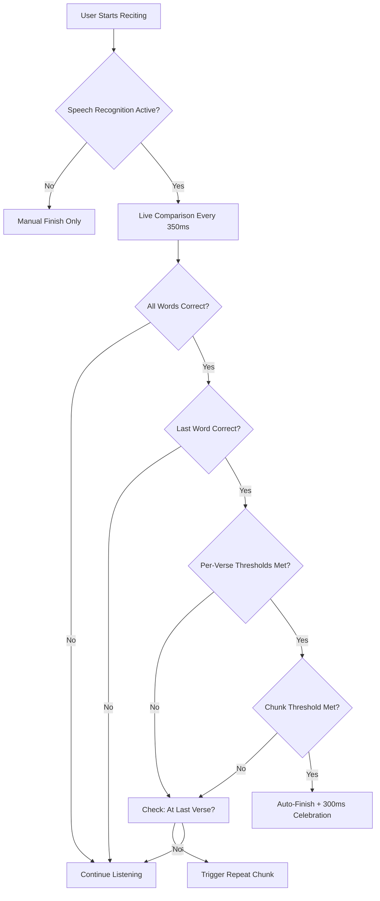
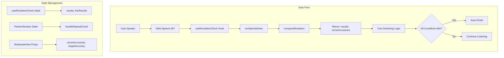

# Smart Session Logic Improvement Plan

## Current State Analysis

### What Works Well
1. **Web Speech API Integration** - Clean hook-based architecture with `useRecitationCheck.js`
2. **Dynamic Programming Alignment** - Wagner-Fischer algorithm in worker for accurate word matching
3. **Sequential Blocking** - Prevents "stolen words" where later correct words mask earlier errors
4. **Live Overlay** - Real-time visual feedback with color-coded word status
5. **Muqatta'at Handling** - Special handling for disjoined letters

### Current Issues & Gaps

| Issue | Location | Description |
|-------|----------|-------------|
| **1. Missing Per-Verse Threshold** | `useRecitationCheck.js:97-112` | Only checks chunk-level accuracy, not per-verse accuracy |
| **2. No Repeat Chunk Logic** | `useRecitationCheck.js` | When threshold not met, user should repeat the chunk |
| **3. Inconsistent State** | `quranUtils.js` vs `recitationWorker.js` | Two different `compareRecitation` implementations |
| **4. No Final Accuracy Check** | `useRecitationCheck.js:235-241` | Final comparison doesn't use threshold logic |
| **5. Missing Verse Boundaries** | `recitationWorker.js` | Worker doesn't know which words belong to which verse |
| **6. No User Override** | `MudarasaView.jsx` | User can't mark a word as correct after false positive |

---

## Proposed Best Logic for Smart Session

### Core Turn-Switching Logic



### Detailed Logic Flow

#### 1. Live Comparison (Worker)
```
Input: expectedText, spokenText, verseBoundaries
Output: {
  results: [{ word, status, spokenWord }],
  verseAccuracies: [{ verseIndex, correct, total, accuracy }],
  smartAnchorHit: boolean,
  preBlockAccuracy: number,
  preBlockHasPending: boolean
}
```

**Key Changes:**
- Accept `verseBoundaries` array to track word-to-verse mapping
- Calculate `verseAccuracies` for each verse in the chunk
- Return `preBlockHasPending` to detect incomplete recitation

#### 2. Turn-Switching Decision (Hook)
```javascript
// In useRecitationCheck.js worker message handler
const { preBlockAccuracy, smartAnchorHit, preBlockHasPending, verseAccuracies } = payload;

// Condition 1: All words must be resolved (no pending)
const allResolved = !preBlockHasPending;

// Condition 2: Last word must be correct (smart anchor)
const lastWordCorrect = smartAnchorHit;

// Condition 3: Per-verse thresholds must be met
const allVerseThresholdsMet = verseAccuracies.every(
  v => v.accuracy >= thresholdRef.current
);

// Condition 4: Overall chunk threshold
const chunkThresholdMet = preBlockAccuracy >= thresholdRef.current;

// Final decision
if (allResolved && lastWordCorrect && allVerseThresholdsMet && chunkThresholdMet) {
  // Auto-finish with celebration delay
} else if (allResolved && lastWordCorrect && isAtLastVerse) {
  // Trigger repeat chunk callback
}
```

#### 3. Repeat Chunk Logic
```javascript
// In PartnerSession.jsx
const handleRepeatChunk = useCallback(() => {
  // Reset to same chunk without advancing
  // Clear results and restart STT
  clearResults();
  // Optionally show feedback: "Please repeat this portion"
}, []);
```

---

## Recommended Improvements

### Priority 1: Core Logic Fixes

1. **Unify Comparison Logic**
   - Remove duplicate `compareRecitation` from `quranUtils.js`
   - Use worker version exclusively for both live and final comparison
   - Ensures consistent behavior

2. **Add Verse Boundary Tracking**
   - Pass verse word counts to worker
   - Calculate per-verse accuracy in worker
   - Return `verseAccuracies` array

3. **Implement Proper Threshold Logic**
   - Check ALL conditions before auto-finish:
     - No pending words
     - Last word correct
     - Per-verse thresholds met
     - Overall chunk threshold met

4. **Add Repeat Chunk Callback**
   - When user reaches end but thresholds not met
   - Reset to same chunk for retry
   - Show "Please repeat" feedback

### Priority 2: UX Enhancements

1. **Per-Verse Progress Indicators**
   - Show accuracy badge per verse in UI
   - Visual feedback for which verses need work

2. **User Override for False Positives**
   - Click on a word to mark as correct
   - Useful for STT misrecognition

3. **Improved Feedback Modes**
   - Stealth: No live overlay, summary only
   - Gentle: Subtle color changes
   - Active: Real-time word highlighting
   - Strict: Immediate error notifications

4. **Session Summary Screen**
   - Show overall accuracy
   - List words to practice
   - Option to retry problematic ayat

### Priority 3: Advanced Features

1. **Tajweed-Aware Comparison**
   - Optional strict mode for tajweed rules
   - Detect madd, ghunnah, qalqalah errors

2. **Cloud Speech Fallback**
   - Google/Whisper API for better accuracy
   - Configurable in settings

3. **Progress Tracking**
   - Store history in localStorage
   - Show improvement over time

---

## Implementation Architecture



---

## Key Design Decisions

### 1. Threshold Configuration
- **Default:** 55% (configurable)
- **Per-verse:** Each verse must meet threshold
- **Chunk:** Overall average must meet threshold
- **Rationale:** Ensures quality at both granular and aggregate levels

### 2. Sequential Blocking
- **Current:** Blocks correct words after errors
- **Improvement:** Also block after pending words
- **Rationale:** User must fix issues in order

### 3. Repeat vs. Advance
- **When to repeat:** All words spoken, last word correct, but thresholds not met
- **When to advance:** All conditions satisfied
- **Rationale:** Prevents skipping poorly recited content

### 4. Manual Override
- **Always available:** "Tap to finish early" button
- **User correction:** Click word to mark correct
- **Rationale:** STT is imperfect; user should have control

---

## Testing Scenarios

| Scenario | Expected Behavior |
|----------|-----------------|
| Perfect recitation | Auto-finish after 300ms |
| 100% on some verses, 0% on others | No auto-finish, repeat triggered at last verse |
| Reaches last word but 40% accuracy (threshold 55%) | No auto-finish, repeat triggered |
| Last word wrong | No auto-finish, continue listening |
| Quiet user (no speech) | All omissions, no auto-finish, manual finish available |
| User taps "finish early" | Final comparison runs, turn advances |

---

## Files to Modify

| File | Changes |
|------|---------|
| `src/workers/recitationWorker.js` | Add verse boundary tracking, return verseAccuracies |
| `src/hooks/useRecitationCheck.js` | Update turn-switching logic, add repeat callback |
| `src/components/MudarasaView.jsx` | Show per-verse accuracy, add user override |
| `src/components/PartnerSession.jsx` | Handle repeat chunk logic |
| `src/utils/quranUtils.js` | Remove duplicate compareRecitation (optional) |

---

## Questions for Clarification

1. **Should the threshold be per-verse OR overall?** The requirements suggest both - is this correct?
2. **What should happen on repeat?** Should we show a message, or just silently restart?
3. **Should we track progress across sessions?** The saved-musaffa-sessions.md suggests this is desired.
4. **Any preference for feedback mode default?** Stealth, Gentle, Active, or Strict?